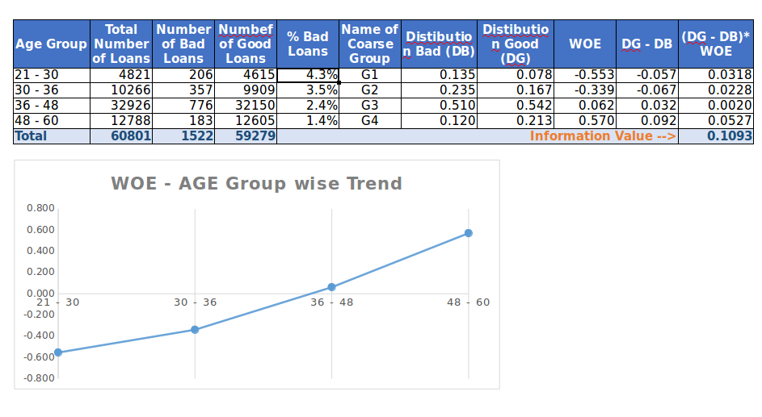
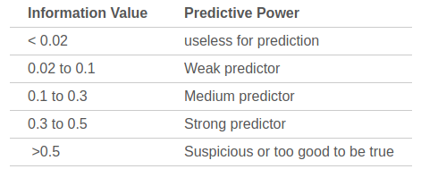

## Information Value

- Information value is a vary useful concept for variable selection during the model building.
- The formula for information value is shown below:

  

(Use [this site](https://www.url-encode-decode.com/) to encode fomula in latex style.)

## Weight of Evidence

$$
WeightofEvidence = ln(\frac{DistributionGood_i}{DistributionBad_i})
$$

If you examine both information value and weight of evidence carefully then you will notice that both these values will break down when either the distribution good or bad goes to zero. A mathematician will hate it. The assumption, a fair one, is that this will never happen while a scorecard development because of the reasonable sample size. A word of caution, if you are developing non-standardized scorecards with smaller sample size use IV carefully.(**?????**)

Now the question is how to interpret this value of IV?  The answer is the rule of thumb described below.

